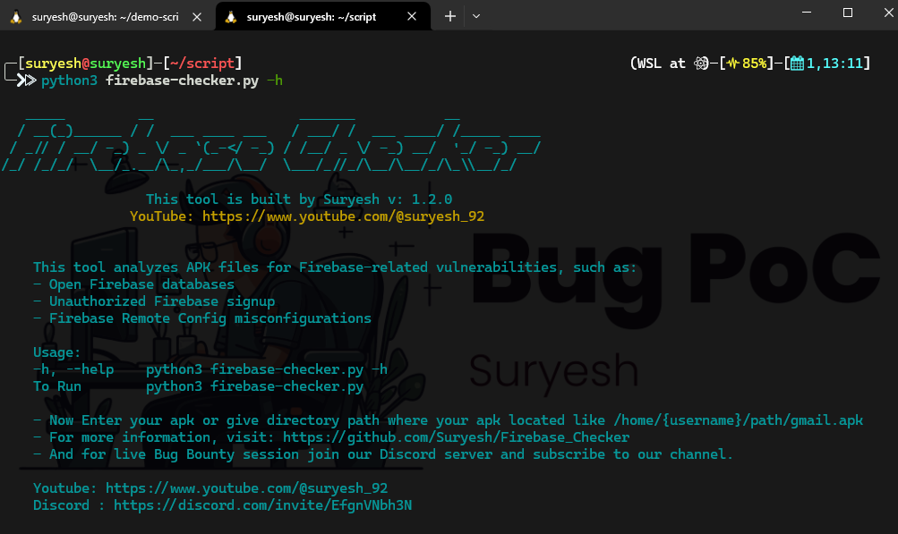
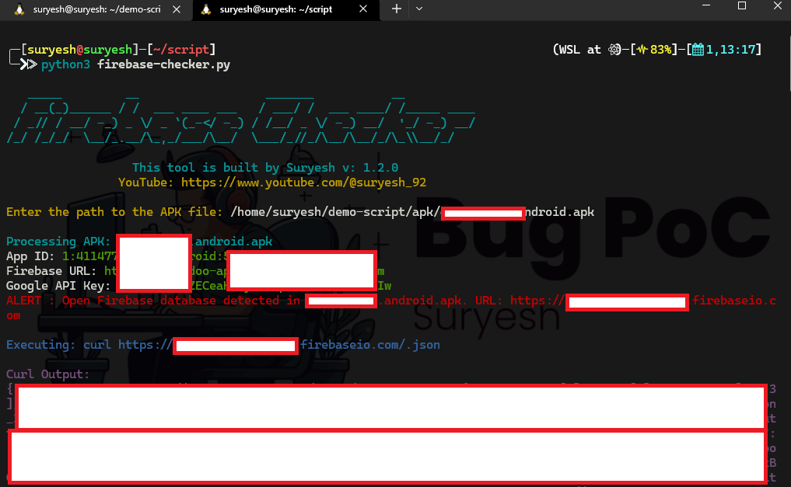
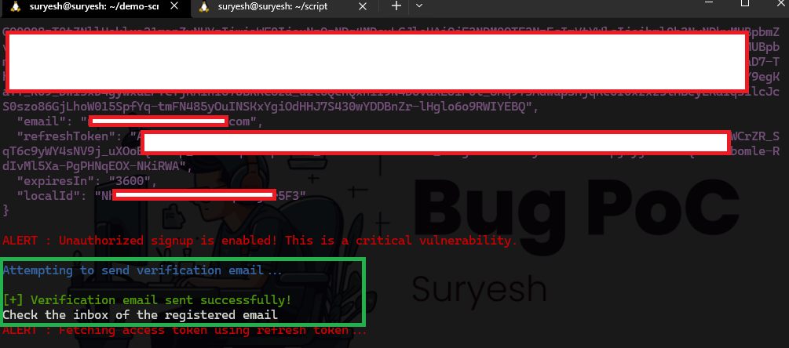
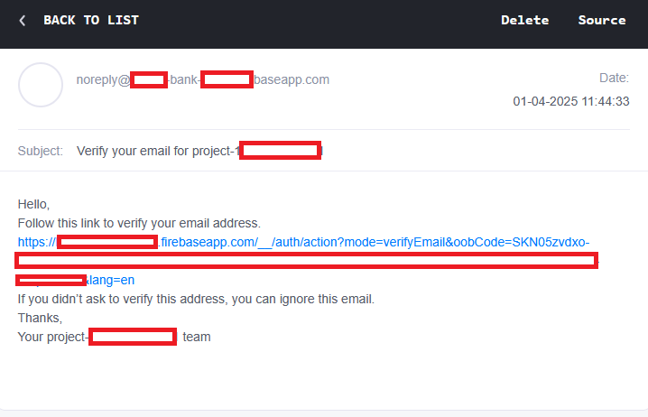

# Firebase_Checker

A Firebase Checker is powerful Python tool to analyze APK files and web applications for Firebase-related vulnerabilities. This tool identifies security misconfigurations in Firebase implementations for both Android and web applications. Designed for security researchers, developers, and penetration testers to identify potential security risks in applications that use Firebase.


## 🚀 New Features in v1.2.1

- **🔍 Dual Testing Mode**: Test both APK files AND web applications manually
- **📱 Firebase Storage Analysis**: Comprehensive storage bucket security testing
- **🎯 Smart File Type Detection**: Automatically handles media files, JSON configs, and data files
- **🔒 Enhanced Security Checks**: Improved vulnerability categorization
- **📊 Better Reporting**: Color-coded results with clear risk levels

# Features

- **Extract Firebase Details:** Automatically extracts Firebase App ID, Firebase URL, and Google API Key from APK files.
- **Check for Open Firebase Databases:** Detects if the Firebase database is publicly accessible.
- **Unauthorized Signup Check:** Tests if unauthorized Firebase signup is possible using the extracted Google API Key.
- **Firebase Remote Config Check:** Identifies if Firebase Remote Config is enabled and accessible.
- **Manual Input Mode**: Test web applications by manually entering Firebase configuration
- **Smart Pattern Recognition**: Identifies Firebase configurations using multiple detection methods
- **Detailed Reporting:** Provides clear and colored output for vulnerability results.
- **Email Verification:** Sending email verification link to registered email.


### 🔒 Security Testing
      ✅ Database Security
      - Open Firebase Realtime Database detection
      - Public read/write access testing
    
      ✅ Authentication Security  
      - Unauthorized user registration testing
      - Email verification functionality
      - Token generation and validation
      - Account information access
    
      ✅ Remote Config Security
      - Firebase Remote Config accessibility
      - Configuration data exposure
    
      ✅ Storage Security
      - Firebase Storage bucket access control
      - File enumeration and listing
      - Smart file type detection (images, PDFs, config files)
      - Bulk file downloading capability

### Storage Bucket Intelligence

- Automatic File Type Detection: Recognizes images, documents, config files
- Smart Download Testing: Different testing methods for media vs data files
- Content Preview: Shows preview of config files without full download


### 📱 Choose testing method:
```
1. Test APK file
2. Enter Firebase details manually

Enter your choice (1 or 2): 1
Enter the path to the APK file: /path/to/app.apk

Choice 2: Manually

Enter your choice (1 or 2): 2

Enter Firebase details (press Enter to skip if not available):
App ID (format: 1:123456789:android:abcdef123456): 
Firebase URL (format: https://project-id.firebaseio.com): https://mywebapp.firebaseio.com
Google API Key (format: AIzaSyD...): AIzaSyDexamplekey123
Storage Bucket (format: project-id.appspot.com): mywebapp.appspot.com

```


# Installation

## Prerequisites

Python 3.x

`requests` library (`pip install requests`)

`termcolor` library (`pip install termcolor`)

## Steps

1. Clone this Repository

```
git clone https://github.com/Suryesh/Firebase_Checker.git && cd Firebase_Checker
```

2. Install the required dependencies:

```
pip install -r requirements.txt
```

3. Now give Executable permission

```
chmod +x firebase-checker.py
```

# Basic Usages

1. Check help for usages

```
python3  firebase-checker.py -h
```
2. Run the script:

```
python3 firebase-checker.py
```

3. Enter your choice 1 or 2 when it prompted:

4. Now the tool will analyze the APK file or the details you provided.

### 🎯 OUTPUT CATEGORIES:
    ❌ VULNERABILITIES DETECTED (Red) - Immediate security risks
    ✅ SECURE CONFIGURATIONS (Green) - Properly secured settings  
    ℹ️  INFORMATION (Blue) - Informational messages
    ⚠️  ERRORS (Yellow) - Testing errors or issues

### 📁 DOWNLOAD OPTIONS:
      - When accessible files are found in storage:
      - Download individual files by number
      - Download ALL files in one operation  
      - View complete file list before downloading
      - Skip downloading if not needed


    
# PoC - 1

### Help



### Vulnerability Checking



### Detected remote Config misconfiguration


### Signup Enable for Unauthorized user


### Fetching Register User Information


### Generating Access Token


### Vulnerability Detected


# PoC - 2


# PoC -3

### API Key in Remote Config file


## Added new email verification features




## License
This project is licensed under the MIT License. See the [](LICENSE) file for details.

 ## 💰 You can help me by Donating
 
  [](https://buymeacoffee.com/suryesh_92) [](https://www.paypal.com/paypalme/Suryesh92) 


## Disclaimer
This tool is intended for educational and ethical testing purposes only. Do not use it for any illegal or unauthorized activities. The author is not responsible for any misuse of this tool.
